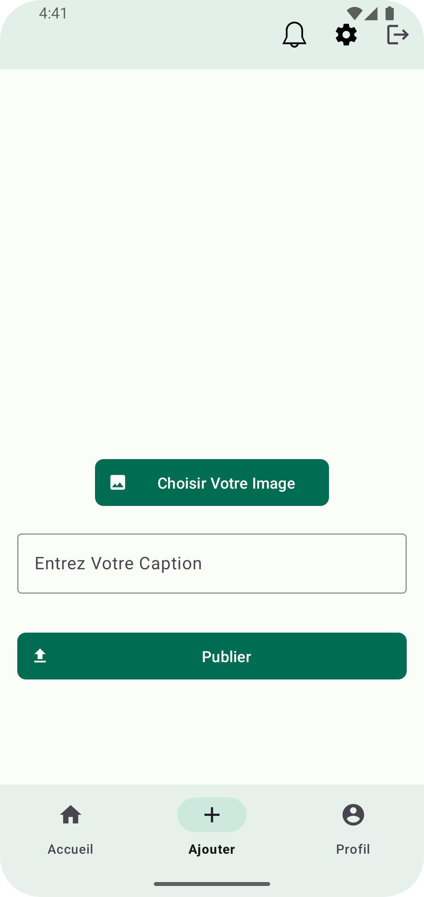
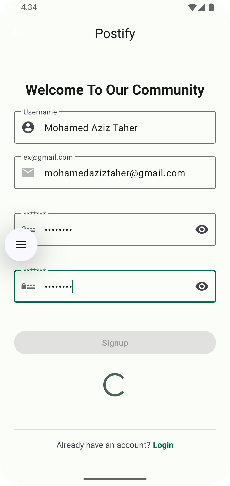
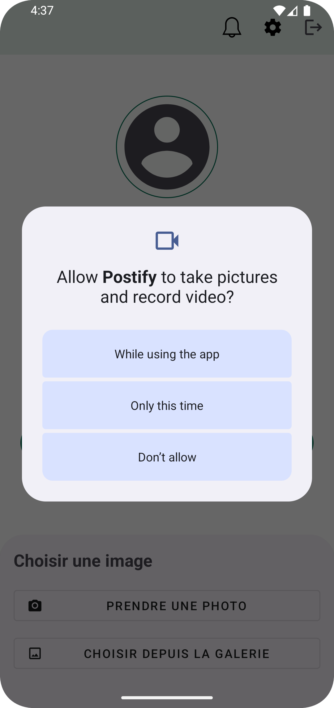
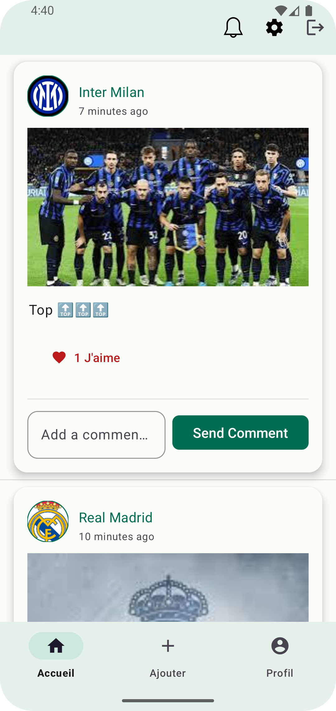
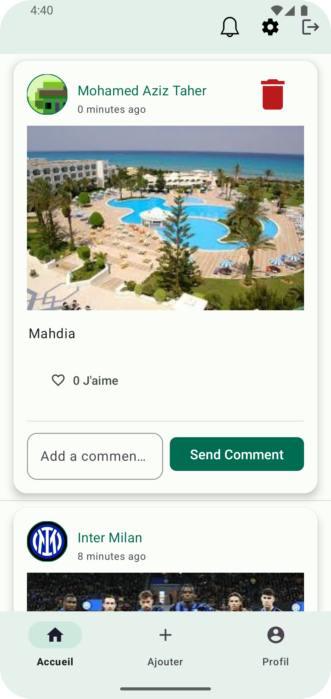
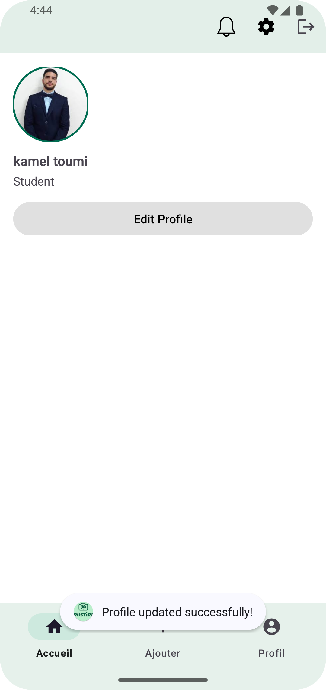
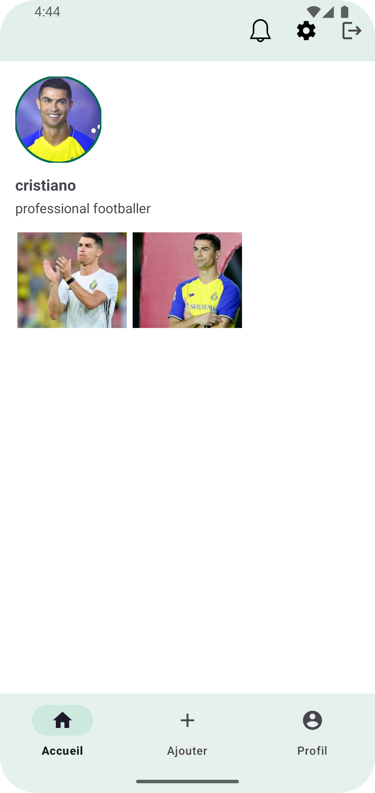

# Postify - Social Media Android App

## Contributors

## Overview
Postify is a modern social media Android application built with Material Design 3 and Firebase, enabling users to share moments, connect with others, and engage with content through an intuitive and visually appealing interface.

## Screenshots

### Authentication Flow

    
    
    

### Main Features

    
    
    

### Profile & Social

    
    

## Features

### Authentication
- Email/Password registration and login
- Profile completion workflow
- Secure Firebase Authentication
- Elegant logout dialog
- Session management

### Posts
- Create posts with images and captions
- Image upload via camera or gallery
- Like and comment functionality
- Real-time post updates
- Post deletion with confirmation
- Cloudinary image storage
- Dynamic image loading
- Adaptive layouts for different content types

### Profile System
- Customizable user profiles
- Profile picture upload
- Bio customization
- User posts grid view
- View other users' profiles
- Profile completion reminders
- Circular profile images

### Social Features
- Interactive post feed
- Real-time comment system
- Like/Unlike animations
- User-to-user navigation
- Post author details
- Comment threading
- Timestamp formatting

### UI/UX
- Material Design 3 implementation
- Custom splash screen
- Responsive layouts
- Dynamic theme colors
- Bottom sheet dialogs
- Loading indicators
- Empty state handling
- Elegant animations
- Error feedback
- Pull-to-refresh

## Technical Stack

### Architecture
- MVVM Architecture Pattern
- Fragment-based navigation
- ViewBinding for views
- Clean Architecture principles
- Repository Pattern

### Backend Services
- Firebase Authentication
- Firebase Realtime Database
- Cloudinary CDN
- Firebase Cloud Storage

### Libraries
- AndroidX Core KTX
- Material Components
- Navigation Component
- Glide for images
- Cloudinary Android
- Firebase SDK
- ViewBinding
- Material Design Components

